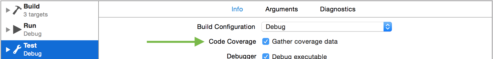

[Codecov][1] Swift Example
==========================

[](https://travis-ci.org/codecov/example-swift) [](https://codecov.io/gh/codecov/example-swift/branch/master)

## Guide
### Travis Setup

Add to your `.travis.yml` file.
```yml
language: swift # or objective-c
osx_image: xcode7
script:
  - xcodebuild -scheme SwiftExample -workspace SwiftExample.xcworkspace -sdk iphonesimulator -destination 'platform=iOS Simulator,name=iPhone 6S,OS=9.1' build test
after_success:
  - bash <(curl -s https://codecov.io/bash)
```
### Produce Coverage Reports
Enable "Gather coverage data" in your test scheme:



#### Strategies for producing coverage reports

##### plist coverage `default`
This technique will upload the plist containing coverage data.
- This format includes all files and projects. However, this can be very large causing issues processing.
- Partial coverage data is included, which will look beautiful in Codecov UI.

Again, this is enabled by default.

##### llvm-cov
This technique will run `llvm-cov` which produces coverage reports.
- You can specify specific packages to run coverage against (see below)
- No partial coverage data

To enable:

```
bash <(curl -s https://codecov.io/bash) -X xcodellvm
# - or -
bash <(curl -s https://codecov.io/bash) -J '^MyPackage$'
# ^^ will enable xcodellvm and only process MyPackage coverage
```

You may provide your Codecov token by either:

- Setting `CODECOV_TOKEN` in your environment variables and adding the following to Travis:
```yml
after_success:
  - bash <(curl -s https://codecov.io/bash)
```
- Providing the Codecov token directly to the invocation by adding the following to Travis:
```yml
after_success:
  - bash <(curl -s https://codecov.io/bash) -t {YOUR-TOKEN-HERE}
```

## Speed up the build
The uploader has a *boil-the-ocean* approach, which can take a longer time to complete coverage report processing.
We suggest you add the following to only build reports for the project being tested:

```sh
bash <(curl -s https://codecov.io/bash) -J 'SwiftExample'
```
> Use your project name instead of `SwiftExample`. You can also provide multiple arguments via `-J 'ProjA' -J 'ProjB'`

## Caveats
### Private Repos
> Set `CODECOV_TOKEN` in your environment variables.

Add to your `.travis.yml` file.
```yml
after_success:
  - bash <(curl -s https://codecov.io/bash) -t uuid-repo-token
```
> Or you can set the environment variable `CODECOV_TOKEN` to your token.

### Xcode8/Swift3 resulting in `0%` coverage.

1. Update the test scheme with Xcode 8
2. Do not use `xcpretty`. Seems broken with code coverage Xcode 8...

Example project with Xcode8/Swift3: [yannickl/DynamicColor](https://github.com/yannickl/DynamicColor/blob/6ac768ba5c14941be5ebe169aca408655e185b20/.travis.yml)

## Support
### Contact
- Email: support@codecov.io
- Slack: slack.codecov.io
- [gh/codecov/support](https://github.com/codecov/support)

1. More documentation at https://docs.codecov.io
2. Configure codecov through the `codecov.yml`  https://docs.codecov.io/docs/codecov-yaml


We are happy to help if you have any questions. Please contact email our Support at [support@codecov.io](mailto:support@codecov.io)

[1]: https://codecov.io/
[4]: https://github.com/codecov/codecov-python
